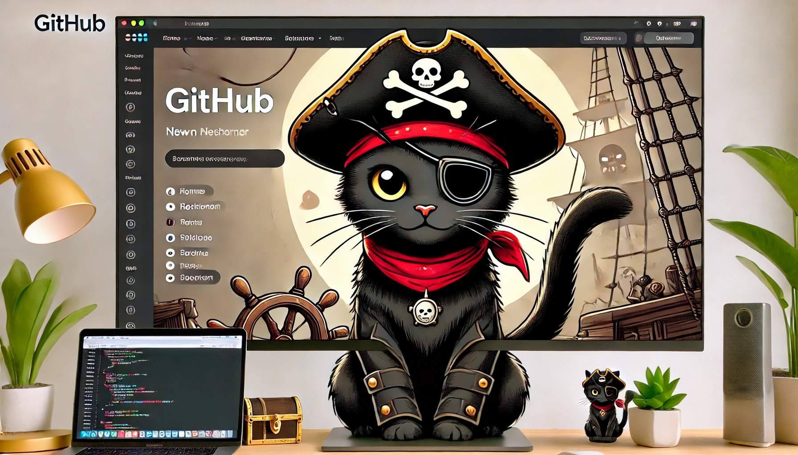

# 👋 Hi there, I'm **@ThanAid**! 

### 😄 Welcome to my GitHub!

- 👀 **What am I interested in?**  
   I'm passionate about **Machine Learning**, **Data Science**, and all things **coding**! 🚀  
   
- 🎓 **My background:**  
   I hold a **Master's degree in Data Science & Machine Learning** 🎓 and have a deep love for solving complex problems with code 💻.  

- 💼 **Current role:**  
   I'm currently working as a **Machine Learning Engineer** 🤖, building models and systems to turn data into actionable insights 📊.

- 🌱 **What I'm learning:**  
   Continuously expanding my skills, experimenting with cutting-edge technologies and frameworks in the AI/ML space 🧠✨.

---

💡 **Fun fact:**  
  I enjoy listening/studying music, and exploring AI use cases in music too 🧩.

Thanks for stopping by! Feel free to connect with me! 😎

<h3 align="left">Connect with me:</h3>

  

<!---

-->

<!---
ThanAid/ThanAid is a ✨ special ✨ repository because its `README.md` (this file) appears on your GitHub profile.
You can click the Preview link to take a look at your changes.
--->
